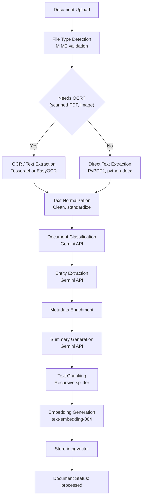
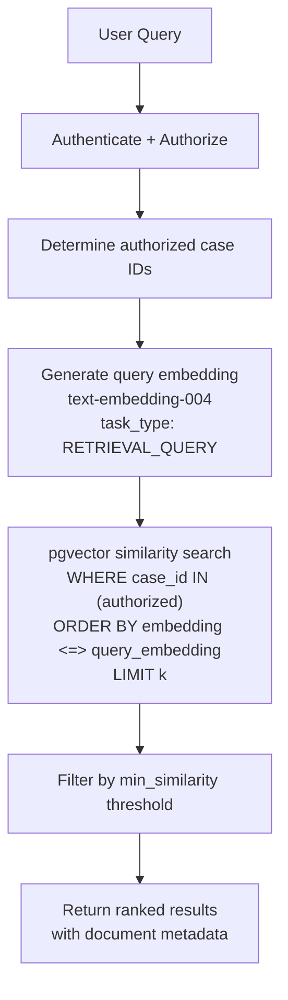
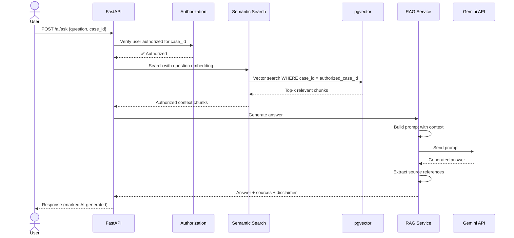

# AI Pipeline — Secure Digital Evidence & Legal Case Lifecycle Management Platform

---

## 1. Pipeline Overview

The AI Document Intelligence pipeline automatically processes uploaded legal/investigation documents through a series of stages to extract structured information, generate searchable content, and enable semantic retrieval.



---

## 2. Pipeline Execution

### 2.1 Trigger

The AI pipeline is triggered asynchronously via **Celery** after a document is uploaded:

```python
# In document upload service
document = create_document(...)  # Save metadata + file to S3
celery_app.send_task("ai.process_document", args=[document.id])
# Document status: "processing"
```

### 2.2 Task Flow

```python
@celery_app.task(bind=True, max_retries=3)
def process_document(self, document_id: str):
    """Full AI processing pipeline for a document."""
    document = get_document(document_id)
    file_bytes = download_from_s3(document.storage_key)

    # Stage 1: Text Extraction
    text = extract_text(file_bytes, document.mime_type)

    # Stage 2: Classification
    classification = classify_document(text)

    # Stage 3: Entity Extraction
    entities = extract_entities(text, classification.document_type)

    # Stage 4: Summary
    summary = generate_summary(text, classification.document_type)

    # Stage 5: Embeddings
    chunks = chunk_text(text)
    embeddings = generate_embeddings(chunks)

    # Stage 6: Store results
    store_ai_results(document_id, classification, entities, summary, embeddings)

    # Update document status
    update_document_status(document_id, status="processed")
    create_notification(document.uploaded_by, "Document processing complete")
```

### 2.3 Error Handling

- Each stage is independently retryable
- Partial failures are recorded (e.g., OCR succeeds but classification fails)
- Document status set to `"failed"` with error details on complete failure
- Notification sent to uploader on failure with option to retry

---

## 3. Stage Details

### 3.1 Text Extraction

| File Type | Method | Library |
|-----------|--------|---------|
| PDF (text) | Direct extraction | PyPDF2 / pdfplumber |
| PDF (scanned) | OCR | Tesseract (pytesseract) |
| Images (PNG, JPG, TIFF) | OCR | Tesseract / EasyOCR |
| DOCX | Direct extraction | python-docx |
| DOC | Conversion + extraction | libreoffice headless → text |
| TXT | Direct read | Built-in |
| XLSX | Cell extraction | openpyxl |

**OCR Detection Logic:**
```python
def needs_ocr(file_bytes: bytes, mime_type: str) -> bool:
    if mime_type in ["image/png", "image/jpeg", "image/tiff"]:
        return True
    if mime_type == "application/pdf":
        text = extract_pdf_text(file_bytes)
        # If extracted text is very short relative to page count, likely scanned
        return len(text.strip()) < 100 * page_count
    return False
```

**Text Normalization:**
- Remove excessive whitespace
- Normalize Unicode characters
- Fix common OCR artifacts
- Preserve paragraph structure

### 3.2 Document Classification

**Model**: Gemini 2.5 Flash

**Prompt Template:**
```
You are a legal document classifier for Indian law enforcement.

Classify the following document into exactly one of these categories:
- fir (First Information Report)
- police_report (Police/Investigation Report)
- investigation_report (Detailed Investigation Report)
- witness_statement (Witness Statement/Testimony)
- charge_sheet (Charge Sheet)
- court_filing (Court Filing/Petition)
- evidence_record (Evidence Collection Record)
- forensic_report (Forensic Analysis Report)
- legal_notice (Legal Notice)
- judgment (Court Judgment/Order)
- supporting_document (Other Supporting Document)

Respond in JSON format:
{
  "document_type": "<category>",
  "confidence": <0.0-1.0>,
  "reasoning": "<brief explanation>"
}

Document text (first 3000 characters):
---
{document_text[:3000]}
---
```

**Output Schema:**
```python
class ClassificationResult(BaseModel):
    document_type: str
    confidence: float  # 0.0 to 1.0
    reasoning: str
```

### 3.3 Entity Extraction

**Model**: Gemini 2.5 Flash

**Prompt Template:**
```
You are an entity extractor for Indian legal/investigation documents.

Extract the following entity types from the document text:
- PERSON: Names of individuals
- ORGANIZATION: Organizations, institutions, companies
- LOCATION: Places, addresses, police stations
- DATE: Dates and time references
- LAW_SECTION: Sections of law (IPC, CrPC, IT Act, etc.)
- CASE_NUMBER: Case/CR numbers
- FIR_NUMBER: FIR numbers
- POLICE_STATION: Police station names
- EVIDENCE_REF: References to evidence items
- PHONE_NUMBER: Phone numbers
- VEHICLE_NUMBER: Vehicle registration numbers

This document is classified as: {document_type}

Respond in JSON format:
{
  "entities": [
    {
      "type": "<entity_type>",
      "value": "<extracted_value>",
      "confidence": <0.0-1.0>
    }
  ]
}

Document text:
---
{document_text[:5000]}
---
```

**Output Schema:**
```python
class ExtractedEntity(BaseModel):
    type: str
    value: str
    confidence: float

class ExtractionResult(BaseModel):
    entities: list[ExtractedEntity]
```

### 3.4 Summary Generation

**Model**: Gemini 2.5 Flash

**Prompt Template:**
```
You are a legal document summarizer for Indian law enforcement.

Generate a concise summary (150-300 words) of the following {document_type}.
Focus on:
- Key facts and findings
- Persons involved
- Dates and locations
- Legal sections referenced
- Actions taken or recommended

Do not add information not present in the document.

Document text:
---
{document_text[:8000]}
---
```

### 3.5 Text Chunking

**Strategy**: Recursive character splitting with overlap

```python
CHUNK_SIZE = 1000      # characters per chunk
CHUNK_OVERLAP = 200    # character overlap between chunks
SEPARATORS = ["\n\n", "\n", ". ", " "]
```

**Chunking Logic:**
1. Split by paragraph boundaries first
2. If chunks too large, split by sentences
3. If still too large, split by words
4. Maintain overlap for context continuity
5. Each chunk stores: `chunk_index`, `chunk_text`, `document_id`

### 3.6 Embedding Generation

**Model**: `text-embedding-004` (768 dimensions)

```python
import google.generativeai as genai

def generate_embeddings(chunks: list[str]) -> list[list[float]]:
    """Generate embeddings for document chunks."""
    embeddings = []
    # Batch processing (max 100 per request)
    for batch in batched(chunks, 100):
        result = genai.embed_content(
            model="models/text-embedding-004",
            content=batch,
            task_type="RETRIEVAL_DOCUMENT"
        )
        embeddings.extend(result["embedding"])
    return embeddings
```

**Storage**: pgvector `VECTOR(768)` column with HNSW index

---

## 4. Semantic Search

### 4.1 Query Flow



### 4.2 SQL Query

```sql
SELECT
    de.document_id,
    de.chunk_text,
    de.chunk_index,
    d.title,
    d.document_type,
    de.case_id,
    1 - (de.embedding <=> :query_embedding) AS similarity
FROM document_embeddings de
JOIN documents d ON d.id = de.document_id
WHERE de.case_id = ANY(:authorized_case_ids)
  AND 1 - (de.embedding <=> :query_embedding) >= :min_similarity
ORDER BY de.embedding <=> :query_embedding
LIMIT :k;
```

---

## 5. RAG (Retrieval-Augmented Generation)

### 5.1 Secure RAG Flow



### 5.2 RAG Prompt Template

```
You are a legal case assistant for Indian law enforcement. You help authorized
officers understand case documents and evidence.

RULES:
1. Answer ONLY based on the provided context documents.
2. If the answer is not in the context, say "I cannot find this information in the available documents."
3. Always cite which document(s) your answer is based on.
4. Do not make up facts or legal conclusions.
5. Do not provide legal advice.
6. Be precise and factual.

CONTEXT DOCUMENTS:
---
{context_chunks_with_source_references}
---

USER QUESTION: {question}

Provide your answer with source references.
```

### 5.3 Security Constraints

| Rule | Enforcement |
|------|-------------|
| Authorization before retrieval | Vector search query includes `WHERE case_id IN (authorized_ids)` |
| No cross-case leakage | Case ID filter applied at database level |
| AI never authorizes | Authorization check is separate from AI pipeline |
| Responses marked as AI-generated | `ai_generated: true` flag in response |
| Source transparency | Every answer includes source document references |
| Context minimization | Only relevant chunks sent to LLM, not full documents |

---

## 6. AI Output Handling in UI

### 6.1 Display Rules

| Element | Display |
|---------|---------|
| AI-classified document type | Shown with "🤖 AI Suggested" badge + confidence % |
| AI-extracted entities | Shown with "AI Extracted" label, "Verify" button |
| AI summary | Shown in collapsible section with "AI Generated" header |
| RAG answer | Shown with "🤖 AI Assistant" badge + disclaimer + source links |
| Human-verified data | Shown with "✓ Verified by [name]" badge |

### 6.2 Confidence Thresholds

| Confidence | Action |
|------------|--------|
| ≥ 0.9 | Auto-populate fields, show as "High confidence" |
| 0.7 – 0.9 | Suggest values, show as "Medium confidence — review recommended" |
| < 0.7 | Show as "Low confidence — manual review required" |

---

## 7. Gemini API Configuration

### 7.1 Model Selection

| Task | Model | Reason |
|------|-------|--------|
| Classification | gemini-2.5-flash | Fast, accurate for categorization |
| Entity Extraction | gemini-2.5-flash | Good structured output |
| Summarization | gemini-2.5-flash | Fast, good for concise summaries |
| RAG Generation | gemini-2.5-flash | Good reasoning with context |
| Embeddings | text-embedding-004 | Purpose-built, 768 dims |

### 7.2 API Configuration

```python
# core/config.py
class AISettings(BaseSettings):
    GEMINI_API_KEY: str
    GEMINI_MODEL: str = "gemini-2.5-flash"
    EMBEDDING_MODEL: str = "models/text-embedding-004"
    EMBEDDING_DIMENSIONS: int = 768

    MAX_INPUT_TOKENS: int = 8000
    MAX_OUTPUT_TOKENS: int = 2000
    TEMPERATURE: float = 0.1  # Low temperature for factual tasks
    TOP_P: float = 0.95

    CHUNK_SIZE: int = 1000
    CHUNK_OVERLAP: int = 200
    SEMANTIC_SEARCH_TOP_K: int = 10
    MIN_SIMILARITY_THRESHOLD: float = 0.7
```

### 7.3 Rate Limiting & Cost Management

- Batch embedding requests (up to 100 texts per call)
- Cache embeddings — regenerate only on new versions
- Use Gemini Flash (not Pro) for cost efficiency
- Rate limit AI endpoints (20 req/min per user)
- Track token usage per request for cost monitoring

---

## 8. Error Handling & Resilience

| Failure | Handling |
|---------|----------|
| OCR fails | Mark document as `ocr_failed`, allow manual text entry |
| Classification fails | Default to `other`, flag for manual classification |
| Entity extraction fails | Log error, skip entities, don't block pipeline |
| Embedding generation fails | Retry 3x, then mark `embedding_failed` (no semantic search for this doc) |
| Gemini API unavailable | Retry with exponential backoff, notify admin after 3 failures |
| RAG query fails | Return error message, suggest traditional search |

---

## 9. Future AI Enhancements

| Feature | Description | Priority |
|---------|-------------|----------|
| Document similarity | Find similar documents across cases (authorized) | Should-have |
| Anomaly detection | Flag unusual patterns in documents | Future |
| Multi-language OCR | Hindi, regional language support | Future |
| Audio/video transcription | Extend to multimedia evidence | Future |
| Advanced NER | Fine-tuned model for Indian legal entities | Future |
| Automated redaction suggestions | AI suggests PII for redaction | Future |

