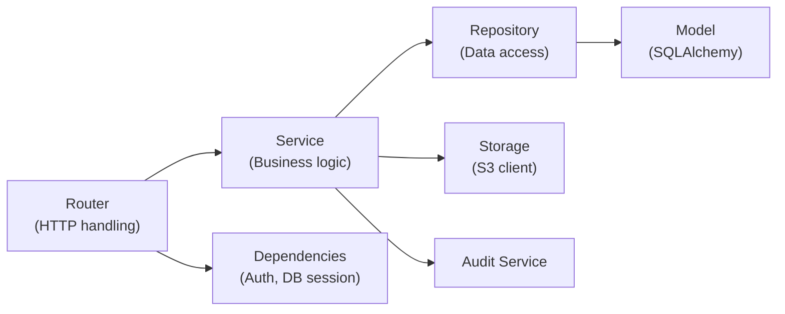
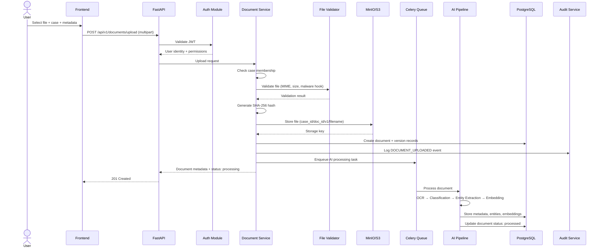
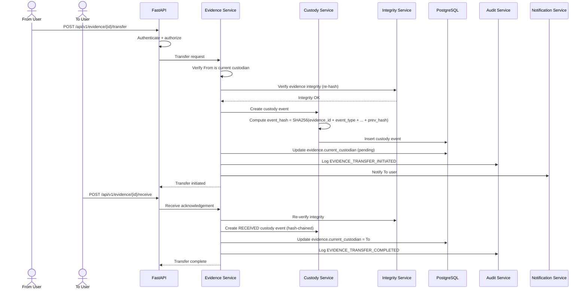
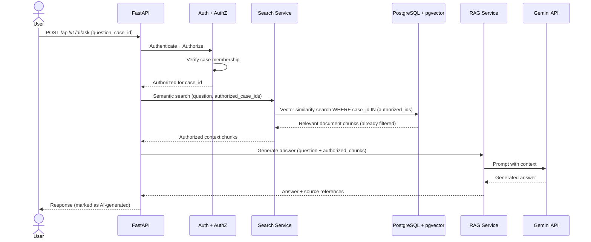
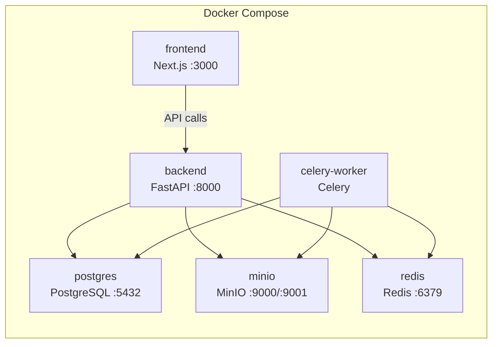

# Architecture — Secure Digital Evidence & Legal Case Lifecycle Management Platform

> **SIH 2026 · Problem Statement SIH26190**
> Organization: Ministry of Home Affairs / NCRB / Women Safety Division
> Theme: Blockchain & Cybersecurity

---

## 1. Project Overview

A zero-trust, AI-assisted digital evidence lifecycle platform where every sensitive legal/investigation document is searchable, access-controlled, cryptographically verifiable, version-controlled, and traceable from creation to legal submission.

### Core Product Statement

> "We are building a zero-trust, AI-assisted digital evidence lifecycle platform where every sensitive document is searchable, access-controlled, cryptographically verifiable, version-controlled and traceable from creation to legal submission."

### Primary Users

| Role | Key Responsibilities |
|------|---------------------|
| **Investigator** | Create/manage cases, upload documents & evidence, search, transfer evidence |
| **Forensic Expert** | Access assigned evidence, upload forensic reports, verify integrity |
| **Legal Officer** | Access case documents, review charge sheets, prepare legal export packages |
| **Supervisor** | Review cases, approve operations, monitor workflows, view analytics |
| **System Administrator** | Manage users/roles, configure policies, monitor security |

---

## 2. System Architecture Overview

```mermaid
graph TB
    subgraph "Client Layer"
        FE["Next.js Frontend<br/>TypeScript + Tailwind + shadcn/ui"]
    end

    subgraph "API Layer"
        GW["API Gateway<br/>FastAPI + Middleware<br/>Rate Limiting · CORS · Auth"]
    end

    subgraph "Application Layer"
        AUTH["Auth Module"]
        USERS["User Mgmt"]
        ROLES["Role & Permission Mgmt"]
        CASES["Case Mgmt"]
        DOCS["Document Mgmt"]
        EVD["Evidence Mgmt"]
        CUSTODY["Chain of Custody"]
        AUDIT["Audit Trail"]
        INTEGRITY["Integrity Verification"]
        SEARCH["Search Engine"]
        AI_MOD["AI Intelligence"]
        NOTIF["Notifications"]
        EXPORT["Legal Export"]
        DASH["Dashboard"]
        SECMON["Security Monitoring"]
    end

    subgraph "AI / ML Pipeline"
        OCR["OCR / Text Extraction"]
        CLASSIFY["Document Classification"]
        NER["Entity Extraction"]
        EMBED["Embedding Generation"]
        RAG["RAG Case Assistant"]
        GEMINI["Google Gemini API"]
    end

    subgraph "Task Queue"
        CELERY["Celery Workers"]
        REDIS["Redis<br/>Broker + Cache + Token Blacklist"]
    end

    subgraph "Data Layer"
        PG["PostgreSQL 16+<br/>pgvector"]
    end

    subgraph "Storage Layer"
        S3["S3-Compatible Object Storage<br/>MinIO (dev) / S3 (prod)"]
    end

    subgraph "Integrity Layer"
        LEDGER["Append-Only Hash-Chained<br/>Tamper-Evident Ledger"]
        FUTURE_BC["Future: Hyperledger Fabric"]
    end

    FE -->|HTTPS / REST| GW
    GW --> AUTH & USERS & ROLES & CASES & DOCS & EVD & CUSTODY & AUDIT & INTEGRITY & SEARCH & AI_MOD & NOTIF & EXPORT & DASH & SECMON

    AI_MOD --> OCR & CLASSIFY & NER & EMBED & RAG
    OCR & CLASSIFY & NER & EMBED & RAG --> GEMINI

    DOCS & EVD --> S3
    DOCS & EVD & AI_MOD --> CELERY
    CELERY --> REDIS

    AUTH & USERS & ROLES & CASES & DOCS & EVD & CUSTODY & AUDIT & INTEGRITY & SEARCH & NOTIF & SECMON --> PG
    EMBED --> PG
    AUDIT --> LEDGER
    LEDGER -.->|Future| FUTURE_BC
```



---

## 3. Technology Stack (Locked)

| Layer | Technology | Version | Justification |
|-------|-----------|---------|---------------|
| **Frontend Framework** | Next.js | 14+ (App Router) | SSR, file-based routing, React Server Components |
| **Frontend Language** | TypeScript | 5+ | Type safety, developer productivity |
| **Styling** | Tailwind CSS | 3+ | Utility-first, rapid UI development |
| **UI Components** | shadcn/ui | Latest | High-quality, accessible, customizable components |
| **Backend Framework** | FastAPI | 0.115+ | Async Python, auto OpenAPI docs, Pydantic integration |
| **Backend Language** | Python | 3.12+ | AI/ML ecosystem, rapid development |
| **Validation** | Pydantic | v2 | Data validation, settings management, schema generation |
| **ORM** | SQLAlchemy | 2.0+ | Mature ORM, async support, migration tooling |
| **Migrations** | Alembic | 1.13+ | SQLAlchemy-native migrations |
| **Database** | PostgreSQL | 16+ | ACID, JSONB, robust, battle-tested |
| **Vector Search** | pgvector | 0.7+ | Semantic search embeddings in PostgreSQL |
| **Object Storage** | MinIO (dev) / S3 (prod) | Latest | S3-compatible, document/evidence file storage |
| **AI / LLM** | Google Gemini API | gemini-2.5-flash | Classification, extraction, summarization, RAG |
| **Embeddings** | text-embedding-004 | — | 768-dim embeddings for semantic search |
| **OCR** | Tesseract / EasyOCR | Latest | Text extraction from scanned documents |
| **Task Queue** | Celery | 5.4+ | Async AI pipeline, background processing |
| **Message Broker** | Redis | 7+ | Celery broker, caching, token blacklist |
| **Auth** | PyJWT / python-jose | Latest | JWT access/refresh token management |
| **Password Hashing** | argon2-cffi | Latest | Argon2id — OWASP recommended |
| **File Hashing** | hashlib (stdlib) | — | SHA-256 for integrity verification |
| **Containerization** | Docker + Docker Compose | Latest | Development and deployment |
| **API Documentation** | OpenAPI / Swagger | 3.1 | Auto-generated by FastAPI |

---

## 4. Core Modules

| # | Module | Description |
|---|--------|-------------|
| 1 | **Authentication** | JWT login/logout, token refresh, password management, account lockout |
| 2 | **User Management** | CRUD users, profiles, department/designation, activation |
| 3 | **Role & Permission Management** | RBAC roles, granular permissions, role assignment |
| 4 | **Case Management** | Case lifecycle, team assignment, status tracking, case timeline |
| 5 | **Document Management** | Upload, storage, metadata, classification, retrieval |
| 6 | **Evidence Management** | Evidence registration, tracking, integrity, custody linkage |
| 7 | **Document Version Control** | Immutable versioning, change tracking, original preservation |
| 8 | **AI Document Intelligence** | OCR, classification, entity extraction, summarization, embeddings |
| 9 | **Search** | Traditional filtered search across cases, documents, evidence |
| 10 | **Semantic Search** | pgvector-powered natural language search with authorization |
| 11 | **Access Control** | RBAC + ABAC policy enforcement, case-level scoping |
| 12 | **Integrity Verification** | SHA-256 hash generation, verification, mismatch alerting |
| 13 | **Chain of Custody** | Hash-chained custody events, transfer tracking, verification |
| 14 | **Digital Signature Support** | Document signing framework (should-have / future) |
| 15 | **Immutable Audit Trail** | Hash-chained append-only audit events for all sensitive actions |
| 16 | **Notifications** | In-app notifications, extensible for email/SMS/push |
| 17 | **Dashboard & Analytics** | Role-specific dashboards, stats, recent activity |
| 18 | **Security Monitoring** | Failed logins, unauthorized access, integrity alerts, brute force detection |
| 19 | **Legal/Court Export Package** | Generate court-ready document bundles with metadata & hashes |
| 20 | **System Administration** | System config, health checks, user admin, security event review |

---

## 5. Backend Architecture

### 5.1 Structure — Modular Monolith

```
backend/
├── app/
│   ├── main.py                          # FastAPI app factory, middleware, CORS, lifespan
│   ├── core/
│   │   ├── config.py                    # Pydantic Settings — all env-based configuration
│   │   ├── security.py                  # JWT creation/validation, password hashing, token utils
│   │   ├── database.py                  # SQLAlchemy async engine, session factory
│   │   ├── dependencies.py              # FastAPI Depends — current_user, db_session, etc.
│   │   ├── logging.py                   # Structured JSON logging (stdlib + JSON formatter)
│   │   ├── exceptions.py                # Custom exception hierarchy + handlers
│   │   └── middleware.py                # Security headers, request ID, audit, rate limiting middleware
│   │
│   ├── modules/
│   │   ├── auth/
│   │   │   ├── router.py               # POST /login, /refresh, /logout, /change-password
│   │   │   ├── service.py              # Authentication business logic
│   │   │   ├── schemas.py              # LoginRequest, TokenResponse, etc.
│   │   │   └── dependencies.py         # get_current_user, require_role, require_case_membership
│   │   │
│   │   ├── users/
│   │   │   ├── router.py
│   │   │   ├── service.py
│   │   │   ├── schemas.py
│   │   │   ├── models.py               # User SQLAlchemy model
│   │   │   └── repository.py           # User data access layer
│   │   │
│   │   ├── roles/
│   │   │   ├── router.py
│   │   │   ├── service.py
│   │   │   ├── schemas.py
│   │   │   ├── models.py               # Role, Permission, UserRole, RolePermission
│   │   │   └── repository.py
│   │   │
│   │   ├── cases/
│   │   │   ├── router.py
│   │   │   ├── service.py
│   │   │   ├── schemas.py
│   │   │   ├── models.py               # Case, CaseMember
│   │   │   └── repository.py
│   │   │
│   │   ├── documents/
│   │   │   ├── router.py
│   │   │   ├── service.py
│   │   │   ├── schemas.py
│   │   │   ├── models.py               # Document, DocumentVersion, DocumentMetadata
│   │   │   └── repository.py
│   │   │
│   │   ├── evidence/
│   │   │   ├── router.py
│   │   │   ├── service.py
│   │   │   ├── schemas.py
│   │   │   ├── models.py               # Evidence
│   │   │   └── repository.py
│   │   │
│   │   ├── custody/
│   │   │   ├── router.py
│   │   │   ├── service.py
│   │   │   ├── schemas.py
│   │   │   ├── models.py               # EvidenceCustodyEvent
│   │   │   └── repository.py
│   │   │
│   │   ├── audit/
│   │   │   ├── router.py
│   │   │   ├── service.py
│   │   │   ├── schemas.py
│   │   │   ├── models.py               # AuditEvent
│   │   │   └── repository.py
│   │   │
│   │   ├── integrity/
│   │   │   ├── router.py
│   │   │   ├── service.py
│   │   │   └── schemas.py
│   │   │
│   │   ├── search/
│   │   │   ├── router.py
│   │   │   ├── service.py
│   │   │   └── schemas.py
│   │   │
│   │   ├── ai/
│   │   │   ├── router.py
│   │   │   ├── service.py
│   │   │   ├── schemas.py
│   │   │   ├── pipeline.py             # Orchestrates full AI processing pipeline
│   │   │   ├── ocr.py                  # Tesseract/EasyOCR integration
│   │   │   ├── classification.py       # Gemini document classification
│   │   │   ├── extraction.py           # Gemini entity extraction
│   │   │   ├── embeddings.py           # text-embedding-004 integration
│   │   │   └── rag.py                  # RAG retrieval + Gemini generation
│   │   │
│   │   ├── notifications/
│   │   │   ├── router.py
│   │   │   ├── service.py
│   │   │   ├── schemas.py
│   │   │   └── models.py
│   │   │
│   │   ├── exports/
│   │   │   ├── router.py
│   │   │   ├── service.py
│   │   │   └── schemas.py
│   │   │
│   │   ├── dashboard/
│   │   │   ├── router.py
│   │   │   ├── service.py
│   │   │   └── schemas.py
│   │   │
│   │   └── security_monitoring/
│   │       ├── router.py
│   │       ├── service.py
│   │       └── models.py
│   │
│   └── storage/
│       ├── s3_client.py                 # MinIO/S3 abstraction layer
│       └── file_validator.py            # MIME check, size limits, malware scan hook
│
├── alembic/                             # Database migrations
│   ├── alembic.ini
│   ├── env.py
│   └── versions/
│
├── tests/
│   ├── conftest.py                      # Fixtures, test DB, test client
│   ├── unit/
│   ├── integration/
│   └── security/
│
├── scripts/
│   ├── seed_data.py                     # Seed roles, permissions, demo users
│   └── demo_setup.py                    # Full demo data population
│
├── requirements.txt
├── Dockerfile
└── .env.example
```

### 5.2 Module Pattern

Every module follows: **Router → Service → Repository → Model**



- **Router**: HTTP endpoint definitions, request parsing, response formatting
- **Service**: Business logic, authorization checks, orchestration
- **Repository**: Database queries, CRUD operations
- **Model**: SQLAlchemy ORM table definitions

---

## 6. Frontend Architecture

```
frontend/
├── src/
│   ├── app/                                 # Next.js App Router
│   │   ├── layout.tsx                       # Root layout
│   │   ├── (auth)/                          # Auth group (no sidebar)
│   │   │   ├── login/page.tsx
│   │   │   └── forgot-password/page.tsx
│   │   ├── (dashboard)/                     # Main app group (with sidebar)
│   │   │   ├── layout.tsx                   # Dashboard layout with sidebar + header
│   │   │   ├── page.tsx                     # Role-specific dashboard home
│   │   │   ├── cases/
│   │   │   │   ├── page.tsx                 # Case listing
│   │   │   │   └── [id]/
│   │   │   │       ├── page.tsx             # Case detail
│   │   │   │       ├── documents/page.tsx
│   │   │   │       ├── evidence/page.tsx
│   │   │   │       ├── custody/page.tsx
│   │   │   │       └── audit/page.tsx
│   │   │   ├── documents/page.tsx
│   │   │   ├── evidence/page.tsx
│   │   │   ├── search/page.tsx
│   │   │   ├── ai-assistant/page.tsx
│   │   │   ├── notifications/page.tsx
│   │   │   ├── exports/page.tsx
│   │   │   └── admin/
│   │   │       ├── users/page.tsx
│   │   │       ├── roles/page.tsx
│   │   │       ├── security/page.tsx
│   │   │       └── system/page.tsx
│   │
│   ├── components/
│   │   ├── ui/                              # shadcn/ui primitives
│   │   ├── layout/                          # Header, Sidebar, Footer, Breadcrumbs
│   │   ├── common/                          # DataTable, FileUpload, StatusBadge, etc.
│   │   └── features/                        # Feature-specific compound components
│   │       ├── cases/
│   │       ├── documents/
│   │       ├── evidence/
│   │       ├── custody/
│   │       ├── audit/
│   │       ├── search/
│   │       └── ai/
│   │
│   ├── lib/
│   │   ├── api.ts                           # Axios/fetch wrapper with auth interceptor
│   │   ├── auth.ts                          # Token management utilities
│   │   └── utils.ts                         # Shared utilities
│   │
│   ├── hooks/                               # Custom React hooks
│   │   ├── use-auth.ts
│   │   ├── use-cases.ts
│   │   ├── use-documents.ts
│   │   ├── use-evidence.ts
│   │   └── use-notifications.ts
│   │
│   ├── services/                            # API service functions
│   │   ├── auth-service.ts
│   │   ├── case-service.ts
│   │   ├── document-service.ts
│   │   ├── evidence-service.ts
│   │   ├── search-service.ts
│   │   └── ai-service.ts
│   │
│   ├── types/                               # TypeScript type definitions
│   │   ├── index.ts
│   │   ├── api.ts
│   │   └── models.ts
│   │
│   ├── store/                               # Zustand state management
│   │   ├── auth-store.ts
│   │   └── notification-store.ts
│   │
│   └── constants/
│       ├── roles.ts
│       ├── permissions.ts
│       └── routes.ts
│
├── public/
├── tailwind.config.ts
├── next.config.ts
├── tsconfig.json
├── package.json
└── Dockerfile
```

### Frontend Design Principles

- **Responsive**: Mobile-first, works on tablet and desktop
- **Accessible**: WCAG 2.1 AA compliance, keyboard navigation, screen reader support
- **State Management**: Zustand for global state, React Query/SWR for server state
- **Error Handling**: Error boundaries, toast notifications, inline validation
- **UX Patterns**: Loading skeletons, empty states, confirmation dialogs for destructive actions
- **Security Indicators**: Integrity status badges, AI-generated content labels, access level indicators

---

## 7. Key Data Flows

### 7.1 Document Upload Flow



### 7.2 Evidence Chain of Custody Transfer



### 7.3 Authorized RAG Query Flow



---

## 8. Deployment Architecture

### 8.1 Development (Docker Compose)



### 8.2 Docker Compose Services

```yaml
services:
  frontend:     # Next.js dev server
  backend:      # FastAPI with uvicorn
  postgres:     # PostgreSQL 16 + pgvector
  minio:        # S3-compatible object storage
  redis:        # Celery broker + cache
  celery-worker: # Background AI processing
```

### 8.3 Production Architecture (Future)

- Kubernetes-ready container images
- Horizontal scaling of backend and workers
- Managed PostgreSQL (RDS or equivalent)
- Managed S3 storage
- Redis cluster
- TLS termination at load balancer
- Secrets via Vault or cloud KMS

---

## 9. Cross-Cutting Concerns

| Concern | Implementation |
|---------|---------------|
| **Logging** | Structured JSON logs via Python standard `logging` + JSON formatter |
| **Error Handling** | Custom exception hierarchy → consistent `{detail, error_code, timestamp}` responses |
| **Configuration** | Pydantic `BaseSettings` with `.env` file support, no hardcoded secrets |
| **Health Checks** | Public `GET /api/v1/health` (liveness) + Admin `GET /api/v1/admin/system/health` (deep readiness: DB, S3, Redis) |
| **API Versioning** | `/api/v1/` prefix, future versions as `/api/v2/` |
| **CORS** | Whitelist origins via config, strict in production |
| **Rate Limiting** | Per-user, per-endpoint via `slowapi` or custom middleware |
| **Request Validation** | Pydantic v2 models for all request bodies |
| **API Documentation** | Auto-generated OpenAPI 3.1 at `/docs` and `/redoc` |
| **Pagination** | Consistent `{items, total, page, size, pages}` response format |

---

## 10. Architectural Principles

1. Security by design
2. Zero-trust principles
3. Least privilege access
4. Defense in depth
5. Separation of concerns
6. Secure-by-default configuration
7. No direct unauthorized file access
8. Backend enforces all authorization
9. Never trust frontend authorization
10. Never let AI make authorization decisions
11. Preserve original evidence always
12. Never silently overwrite evidence
13. Maintain complete version history
14. Every sensitive action must be auditable
15. Every evidence transfer must be traceable
16. Fail securely
17. Validate every uploaded file
18. Never expose sensitive information in errors/logs
19. Maintain clear API boundaries
20. Keep the system modular and extensible

---

## 11. Future Extensibility

| Future Capability | Architecture Support |
|-------------------|---------------------|
| **Hyperledger Fabric** | Audit/integrity layer abstraction allows pluggable blockchain backend |
| **HSM/KMS** | Cryptographic operations are centralized in `core/security.py` and `integrity/` |
| **Multi-agency Federation** | Tenant/agency model can be added to case/user hierarchy |
| **Court System Integration** | Legal export module provides standard package format |
| **Mobile Application** | API-first design, all frontend features accessible via REST |
| **National-scale Deployment** | Stateless backend, horizontal scaling, managed DB/storage |
| **SIEM Integration** | Security monitoring module provides structured events for forwarding |
| **Government Identity** | Auth module abstracts identity provider, can integrate SSO/Aadhaar |

---

## 12. Repository Structure (Complete)

```
SIH-190/
├── backend/                    # Python FastAPI backend
├── frontend/                   # Next.js TypeScript frontend
├── docker-compose.yml          # Development environment
├── docker-compose.prod.yml     # Production configuration
├── docs/                       # Architecture & design documents
│   ├── ARCHITECTURE.md         # This file
│   ├── SECURITY_MODEL.md
│   ├── DATABASE_DESIGN.md
│   ├── API_SPEC.md
│   ├── AI_PIPELINE.md
│   ├── DEVELOPMENT_RULES.md
│   └── IMPLEMENTATION_ROADMAP.md
├── scripts/                    # Utility scripts
├── .gitignore
├── .env.example
└── README.md
```

