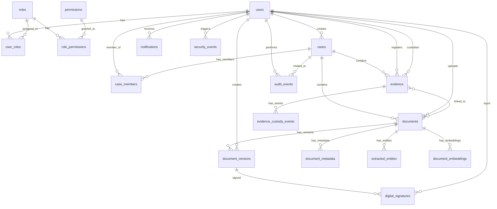
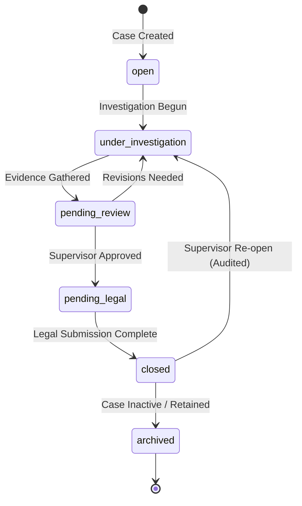
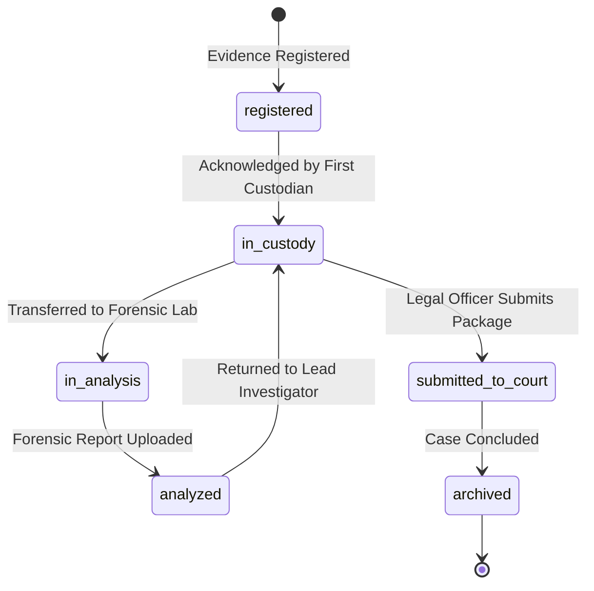

# Database Design — Secure Digital Evidence & Legal Case Lifecycle Management Platform

---

## 1. Design Principles

| Principle | Implementation |
|-----------|---------------|
| **Normalization** | 3NF with practical denormalization for performance |
| **Primary Keys** | UUID v4 for all tables |
| **Timestamps** | `created_at` and `updated_at` on all tables (auto-managed) |
| **Soft Delete** | `is_active` / `is_deleted` flags where appropriate (never hard-delete audit/evidence) |
| **No Binary Storage** | Files stored in S3; database stores metadata and references only |
| **Vector Storage** | pgvector extension for 768-dim embeddings (text-embedding-004) |
| **Foreign Keys** | Enforced with appropriate CASCADE/RESTRICT rules |
| **Indexing** | Strategic indexes on FKs, search columns, and vector columns |

---

## 2. Entity-Relationship Diagram

---

## 3. Table Definitions

### 3.1 `users`

| Column | Type | Constraints | Description |
|--------|------|-------------|-------------|
| `id` | UUID | PK, DEFAULT gen_random_uuid() | Unique user identifier |
| `employee_id` | VARCHAR(50) | UNIQUE, NOT NULL | Government employee ID |
| `email` | VARCHAR(255) | UNIQUE, NOT NULL | Login email |
| `full_name` | VARCHAR(255) | NOT NULL | Full name |
| `password_hash` | VARCHAR(255) | NOT NULL | Argon2id hash |
| `role_id` | UUID | FK → roles, NOT NULL | Primary user role (Single-role per user locked) |
| `phone` | VARCHAR(20) | | Contact phone |
| `department` | VARCHAR(100) | | Department name |
| `designation` | VARCHAR(100) | | Job designation |
| `is_active` | BOOLEAN | DEFAULT true | Account active flag |
| `is_locked` | BOOLEAN | DEFAULT false | Account lockout flag |
| `failed_login_attempts` | INTEGER | DEFAULT 0 | Consecutive failed logins |
| `locked_until` | TIMESTAMPTZ | | Lockout expiry time |
| `last_login` | TIMESTAMPTZ | | Last successful login |
| `created_at` | TIMESTAMPTZ | DEFAULT NOW() | Record creation time |
| `updated_at` | TIMESTAMPTZ | | Last update time |

**Indexes**: `employee_id` (unique), `email` (unique), `role_id`, `department`, `is_active`

---

### 3.2 `roles`

| Column | Type | Constraints | Description |
|--------|------|-------------|-------------|
| `id` | UUID | PK | Role identifier |
| `name` | VARCHAR(50) | UNIQUE, NOT NULL | Machine name (investigator, forensic_expert, legal_officer, supervisor, system_admin) |
| `display_name` | VARCHAR(100) | NOT NULL | Human-readable name |
| `description` | TEXT | | Role description |
| `is_system_role` | BOOLEAN | DEFAULT false | Protected system role flag |
| `created_at` | TIMESTAMPTZ | DEFAULT NOW() | |

---

### 3.3 `permissions`

| Column | Type | Constraints | Description |
|--------|------|-------------|-------------|
| `id` | UUID | PK | Permission identifier |
| `resource` | VARCHAR(100) | NOT NULL | Resource type (cases, documents, evidence, etc.) |
| `action` | VARCHAR(50) | NOT NULL | Action (create, read, update, delete, transfer, verify, approve, export, download) |
| `description` | TEXT | | Permission description |

**Constraints**: UNIQUE(`resource`, `action`)

---

### 3.4 `role_permissions`

| Column | Type | Constraints | Description |
|--------|------|-------------|-------------|
| `role_id` | UUID | FK → roles, ON DELETE CASCADE | |
| `permission_id` | UUID | FK → permissions, ON DELETE CASCADE | |

**Primary Key**: (`role_id`, `permission_id`)

---

### 3.5 `user_roles`

| Column | Type | Constraints | Description |
|--------|------|-------------|-------------|
| `user_id` | UUID | FK → users, ON DELETE CASCADE | |
| `role_id` | UUID | FK → roles, ON DELETE CASCADE | |
| `assigned_by` | UUID | FK → users | Who assigned the role |
| `assigned_at` | TIMESTAMPTZ | DEFAULT NOW() | When assigned |

**Primary Key**: (`user_id`, `role_id`)

---

### 3.6 `cases`

| Column | Type | Constraints | Description |
|--------|------|-------------|-------------|
| `id` | UUID | PK | Case identifier |
| `case_number` | VARCHAR(100) | UNIQUE, NOT NULL | Official case number |
| `fir_number` | VARCHAR(100) | | FIR number if applicable |
| `title` | VARCHAR(500) | NOT NULL | Case title |
| `description` | TEXT | | Case description |
| `status` | VARCHAR(50) | NOT NULL, DEFAULT 'open' | open, under_investigation, pending_review, pending_legal, closed, archived |
| `priority` | VARCHAR(20) | DEFAULT 'medium' | critical, high, medium, low |
| `category` | VARCHAR(100) | | Case category |
| `police_station` | VARCHAR(255) | | Originating police station |
| `district` | VARCHAR(100) | | District |
| `state` | VARCHAR(100) | | State |
| `investigating_officer_id` | UUID | FK → users | Lead investigating officer |
| `created_by` | UUID | FK → users, NOT NULL | Who created the case |
| `created_at` | TIMESTAMPTZ | DEFAULT NOW() | |
| `updated_at` | TIMESTAMPTZ | | |
| `closed_at` | TIMESTAMPTZ | | When case was closed |

**Indexes**: `case_number` (unique), `fir_number`, `status`, `priority`, `investigating_officer_id`, `created_by`, `police_station`, `created_at`

**Check Constraints**: `status IN ('open', 'under_investigation', 'pending_review', 'pending_legal', 'closed', 'archived')`, `priority IN ('critical', 'high', 'medium', 'low')`

---

### 3.7 `case_members`

| Column | Type | Constraints | Description |
|--------|------|-------------|-------------|
| `id` | UUID | PK | |
| `case_id` | UUID | FK → cases, NOT NULL | |
| `user_id` | UUID | FK → users, NOT NULL | |
| `role_in_case` | VARCHAR(50) | NOT NULL | lead_investigator, investigator, forensic_analyst, legal_counsel, supervisor, reviewer |
| `added_by` | UUID | FK → users | Who added this member |
| `added_at` | TIMESTAMPTZ | DEFAULT NOW() | |
| `removed_at` | TIMESTAMPTZ | | When removed (soft remove) |
| `is_active` | BOOLEAN | DEFAULT true | |

**Indexes**: (`case_id`, `user_id`, `is_active`), `user_id`

**Unique**: Partial unique on (`case_id`, `user_id`) WHERE `is_active = true`

---

### 3.8 `documents`

| Column | Type | Constraints | Description |
|--------|------|-------------|-------------|
| `id` | UUID | PK | Document identifier |
| `case_id` | UUID | FK → cases, NOT NULL | Parent case |
| `title` | VARCHAR(500) | NOT NULL | Document title |
| `description` | TEXT | | Description |
| `document_type` | VARCHAR(100) | NOT NULL | fir, police_report, investigation_report, witness_statement, charge_sheet, court_filing, evidence_record, forensic_report, legal_notice, judgment, supporting_document, other |
| `classification` | VARCHAR(50) | DEFAULT 'internal' | public, internal, confidential, secret, top_secret |
| `status` | VARCHAR(50) | DEFAULT 'uploading' | uploading, processing, processed, failed, archived |
| `current_version_id` | UUID | FK → document_versions | Pointer to latest version |
| `original_filename` | VARCHAR(500) | | Original uploaded filename |
| `mime_type` | VARCHAR(100) | | MIME type of original file |
| `file_size_bytes` | BIGINT | | Size of current version |
| `uploaded_by` | UUID | FK → users, NOT NULL | Who uploaded |
| `is_evidence` | BOOLEAN | DEFAULT false | Linked to evidence record |
| `evidence_id` | UUID | FK → evidence, NULLABLE | Linked evidence |
| `ai_processed` | BOOLEAN | DEFAULT false | AI pipeline completed |
| `ai_classification` | VARCHAR(100) | | AI-determined document type |
| `ai_confidence` | FLOAT | | AI classification confidence (0-1) |
| `ocr_text` | TEXT | | Extracted text (for search, max 2MB in DB; larger in S3) |
| `summary` | TEXT | | AI-generated summary |
| `ai_processing_error` | TEXT | | Error details if AI pipeline processing failed |
| `created_at` | TIMESTAMPTZ | DEFAULT NOW() | |
| `updated_at` | TIMESTAMPTZ | | |

**Indexes**: `case_id`, `document_type`, `status`, `uploaded_by`, `evidence_id`, `created_at`, GIN index on `ocr_text` for full-text search

> **Circular FK Handling Note**: `documents.current_version_id` is defined as NULLABLE. When a document is first uploaded, the application creates the `documents` row with `current_version_id = NULL`, creates `document_versions` with `version_number = 1`, and then updates `documents.current_version_id` to point to version 1 within the same database transaction.

---

### 3.9 `document_versions`

| Column | Type | Constraints | Description |
|--------|------|-------------|-------------|
| `id` | UUID | PK | Version identifier |
| `document_id` | UUID | FK → documents, NOT NULL | Parent document |
| `version_number` | INTEGER | NOT NULL | Sequential version number |
| `storage_key` | VARCHAR(500) | NOT NULL | S3 object key |
| `storage_bucket` | VARCHAR(100) | NOT NULL | S3 bucket name |
| `file_hash_sha256` | VARCHAR(64) | NOT NULL | SHA-256 hex digest |
| `file_size_bytes` | BIGINT | | File size |
| `mime_type` | VARCHAR(100) | | MIME type |
| `change_reason` | TEXT | | Why this version was created |
| `created_by` | UUID | FK → users, NOT NULL | Who created this version |
| `created_at` | TIMESTAMPTZ | DEFAULT NOW() | |
| `is_original` | BOOLEAN | DEFAULT false | First version flag |
| `integrity_status` | VARCHAR(20) | DEFAULT 'verified' | verified, compromised, pending |
| `last_verified_at` | TIMESTAMPTZ | | Last integrity check time |

**Unique**: (`document_id`, `version_number`)
**Indexes**: `document_id`, `file_hash_sha256`, `integrity_status`

---

### 3.10 `document_metadata`

| Column | Type | Constraints | Description |
|--------|------|-------------|-------------|
| `id` | UUID | PK | |
| `document_id` | UUID | FK → documents, NOT NULL | |
| `key` | VARCHAR(255) | NOT NULL | Metadata field name |
| `value` | TEXT | | Metadata value |
| `source` | VARCHAR(50) | NOT NULL | manual, ai_extracted, system |
| `confidence` | FLOAT | | AI confidence score (0-1) |
| `verified_by` | UUID | FK → users | Who verified (for AI-extracted) |
| `verified_at` | TIMESTAMPTZ | | When verified |
| `created_at` | TIMESTAMPTZ | DEFAULT NOW() | |

**Indexes**: (`document_id`, `key`), `source`

---

### 3.11 `extracted_entities`

| Column | Type | Constraints | Description |
|--------|------|-------------|-------------|
| `id` | UUID | PK | |
| `document_id` | UUID | FK → documents, NOT NULL | |
| `entity_type` | VARCHAR(100) | NOT NULL | person, organization, location, date, law_section, case_number, fir_number, police_station, evidence_ref, phone_number, vehicle_number |
| `entity_value` | TEXT | NOT NULL | Extracted value |
| `confidence` | FLOAT | | AI confidence (0-1) |
| `start_offset` | INTEGER | | Character start position in text |
| `end_offset` | INTEGER | | Character end position in text |
| `source` | VARCHAR(50) | DEFAULT 'ai' | ai, manual |
| `verified` | BOOLEAN | DEFAULT false | Human-verified flag |
| `created_at` | TIMESTAMPTZ | DEFAULT NOW() | |

**Indexes**: `document_id`, `entity_type`, (`entity_type`, `entity_value`)

---

### 3.12 `evidence`

| Column | Type | Constraints | Description |
|--------|------|-------------|-------------|
| `id` | UUID | PK | Evidence identifier |
| `case_id` | UUID | FK → cases, NOT NULL | Parent case |
| `evidence_number` | VARCHAR(100) | UNIQUE, NOT NULL | Official evidence number |
| `evidence_type` | VARCHAR(100) | NOT NULL | physical, digital, documentary, forensic, testimonial |
| `title` | VARCHAR(500) | NOT NULL | Evidence title |
| `description` | TEXT | | Evidence description |
| `source` | VARCHAR(500) | | Where evidence was obtained |
| `current_custodian_id` | UUID | FK → users | Current custodian |
| `status` | VARCHAR(50) | DEFAULT 'registered' | registered, in_custody, in_analysis, analyzed, submitted_to_court, archived |
| `sensitivity_level` | VARCHAR(50) | DEFAULT 'standard' | standard, sensitive, highly_sensitive, classified |
| `storage_key` | VARCHAR(500) | | S3 object key (for digital evidence) |
| `storage_bucket` | VARCHAR(100) | | S3 bucket |
| `original_file_hash` | VARCHAR(64) | | SHA-256 at registration time |
| `current_file_hash` | VARCHAR(64) | | Latest computed SHA-256 |
| `integrity_status` | VARCHAR(20) | DEFAULT 'verified' | verified, compromised, pending |
| `mime_type` | VARCHAR(100) | | File MIME type |
| `file_size_bytes` | BIGINT | | File size |
| `collection_date` | TIMESTAMPTZ | | When evidence was collected |
| `collection_location` | TEXT | | Where evidence was collected |
| `registered_by` | UUID | FK → users, NOT NULL | Who registered it |
| `created_at` | TIMESTAMPTZ | DEFAULT NOW() | |
| `updated_at` | TIMESTAMPTZ | | |

**Indexes**: `case_id`, `evidence_number` (unique), `current_custodian_id`, `status`, `integrity_status`, `evidence_type`

---

### 3.13 `evidence_custody_events`

| Column | Type | Constraints | Description |
|--------|------|-------------|-------------|
| `id` | UUID | PK | Event identifier |
| `evidence_id` | UUID | FK → evidence, NOT NULL | Related evidence |
| `event_type` | VARCHAR(50) | NOT NULL | registered, transferred, received, analyzed, verified, submitted, returned |
| `from_user_id` | UUID | FK → users, NULLABLE | Source custodian (null for registration) |
| `to_user_id` | UUID | FK → users, NOT NULL | Target custodian |
| `reason` | TEXT | NOT NULL | Purpose of transfer/event |
| `location` | VARCHAR(500) | | Physical location if applicable |
| `notes` | TEXT | | Additional notes |
| `file_hash_at_event` | VARCHAR(64) | | SHA-256 hash at time of event |
| `previous_event_hash` | VARCHAR(64) | | Hash of previous custody event (chain) |
| `event_hash` | VARCHAR(64) | NOT NULL | SHA-256 hash of this event's data |
| `digital_signature` | TEXT | | Digital signature reference (future) |
| `timestamp` | TIMESTAMPTZ | NOT NULL, DEFAULT NOW() | Event timestamp |

**Hash Computation**: `event_hash = SHA256(evidence_id + event_type + from_user_id + to_user_id + timestamp + previous_event_hash)`

**Indexes**: `evidence_id`, `from_user_id`, `to_user_id`, `timestamp`, `event_type`

---

### 3.14 `audit_events`

| Column | Type | Constraints | Description |
|--------|------|-------------|-------------|
| `id` | UUID | PK | Event identifier |
| `actor_id` | UUID | FK → users, NULLABLE | Who performed the action (null = system) |
| `action` | VARCHAR(100) | NOT NULL | Action performed (LOGIN, DOCUMENT_UPLOADED, etc.) |
| `resource_type` | VARCHAR(100) | NOT NULL | Resource type (user, case, document, evidence, etc.) |
| `resource_id` | UUID | | Affected resource ID |
| `case_id` | UUID | FK → cases, NULLABLE | Related case (for case-scoped queries) |
| `details` | JSONB | | Structured action details (includes purpose, params) |
| `result` | VARCHAR(20) | NOT NULL | success, failure, denied |
| `ip_address` | INET | | Client IP address |
| `user_agent` | VARCHAR(500) | | Client user agent |
| `session_id` | VARCHAR(255) | | Session/token ID |
| `previous_event_hash` | VARCHAR(64) | | Hash of previous audit event |
| `event_hash` | VARCHAR(64) | NOT NULL | SHA-256 hash of this event |
| `timestamp` | TIMESTAMPTZ | NOT NULL, DEFAULT NOW() | Event timestamp |

**Append-only**: No UPDATE or DELETE allowed from application layer. Protected by database-level policy or application-only enforcement.
**Concurrency Control**: Sequential hash chaining writes use a Postgres transactional advisory lock (`pg_advisory_xact_lock(hashtext('audit_chain_lock'))`) to prevent race conditions during hash computation.

**Indexes**: `actor_id`, `action`, `resource_type`, (`resource_type`, `resource_id`), `case_id`, `timestamp`, `result`

---

### 3.15 `document_embeddings`

| Column | Type | Constraints | Description |
|--------|------|-------------|-------------|
| `id` | UUID | PK | |
| `document_id` | UUID | FK → documents, NOT NULL | Source document |
| `case_id` | UUID | FK → cases, NOT NULL | Denormalized case reference for fast authorized filtering |
| `chunk_index` | INTEGER | NOT NULL | Chunk sequence number |
| `chunk_text` | TEXT | NOT NULL | Text content of chunk |
| `embedding` | VECTOR(768) | NOT NULL | text-embedding-004 vector |
| `created_at` | TIMESTAMPTZ | DEFAULT NOW() | |

**Indexes**: HNSW index on `embedding` column for similarity search, `case_id`, (`document_id`, `chunk_index`)

---

### 3.16 `notifications`

| Column | Type | Constraints | Description |
|--------|------|-------------|-------------|
| `id` | UUID | PK | |
| `user_id` | UUID | FK → users, NOT NULL | Recipient |
| `type` | VARCHAR(100) | NOT NULL | evidence_transfer, assignment, approval_request, integrity_alert, security_alert, processing_complete, export_ready |
| `title` | VARCHAR(500) | NOT NULL | Notification title |
| `message` | TEXT | | Notification body |
| `resource_type` | VARCHAR(100) | | Related resource type |
| `resource_id` | UUID | | Related resource ID |
| `is_read` | BOOLEAN | DEFAULT false | Read status |
| `created_at` | TIMESTAMPTZ | DEFAULT NOW() | |
| `read_at` | TIMESTAMPTZ | | When read |

**Indexes**: (`user_id`, `is_read`), `created_at`

---

### 3.17 `security_events`

| Column | Type | Constraints | Description |
|--------|------|-------------|-------------|
| `id` | UUID | PK | |
| `event_type` | VARCHAR(100) | NOT NULL | failed_login, unauthorized_access, integrity_alert, brute_force, suspicious_upload, privilege_escalation_attempt, token_abuse, custody_chain_break |
| `severity` | VARCHAR(20) | NOT NULL | info, warning, critical |
| `actor_id` | UUID | FK → users, NULLABLE | Who triggered it |
| `ip_address` | INET | | Source IP |
| `details` | JSONB | | Event details |
| `resolved` | BOOLEAN | DEFAULT false | Resolution status |
| `resolved_by` | UUID | FK → users | Who resolved |
| `resolved_at` | TIMESTAMPTZ | | Resolution time |
| `created_at` | TIMESTAMPTZ | DEFAULT NOW() | |

**Indexes**: `event_type`, `severity`, `actor_id`, `resolved`, `created_at`

---

### 3.18 `digital_signatures` (Should-Have / Future)

| Column | Type | Constraints | Description |
|--------|------|-------------|-------------|
| `id` | UUID | PK | |
| `document_version_id` | UUID | FK → document_versions, NOT NULL | Signed version |
| `signer_id` | UUID | FK → users, NOT NULL | Who signed |
| `signature_data` | TEXT | NOT NULL | Signature blob |
| `algorithm` | VARCHAR(50) | NOT NULL | RSA-SHA256, ECDSA, etc. |
| `certificate_reference` | VARCHAR(500) | | Certificate reference |
| `signed_hash` | VARCHAR(64) | NOT NULL | Hash that was signed |
| `timestamp` | TIMESTAMPTZ | NOT NULL, DEFAULT NOW() | |
| `is_valid` | BOOLEAN | DEFAULT true | Current validation status |
| `verified_at` | TIMESTAMPTZ | | Last verification |

---

### 3.19 `export_packages`

| Column | Type | Constraints | Description |
|--------|------|-------------|-------------|
| `id` | UUID | PK | Package identifier |
| `case_id` | UUID | FK → cases, NOT NULL | Exported case |
| `requested_by` | UUID | FK → users, NOT NULL | User who requested export |
| `status` | VARCHAR(50) | DEFAULT 'pending' | pending, generating, completed, failed |
| `package_storage_key` | VARCHAR(500) | | S3 key to zipped export package |
| `package_hash_sha256` | VARCHAR(64) | | Integrity hash of generated export zip |
| `file_size_bytes` | BIGINT | | Package archive size |
| `manifest` | JSONB | | Package manifest (file lists, hashes, signatures) |
| `error_message` | TEXT | | Failure reason if generation failed |
| `created_at` | TIMESTAMPTZ | DEFAULT NOW() | |
| `completed_at` | TIMESTAMPTZ | | |

**Indexes**: `case_id`, `requested_by`, `status`, `created_at`

---

## 4. Indexing Strategy Summary

| Table | Index | Type | Purpose |
|-------|-------|------|---------|
| `users` | `email` | UNIQUE B-tree | Login lookup |
| `users` | `employee_id` | UNIQUE B-tree | Employee lookup |
| `users` | `role_id` | B-tree | Role lookup |
| `cases` | `case_number` | UNIQUE B-tree | Case lookup |
| `cases` | `fir_number` | B-tree | FIR search |
| `cases` | `status` | B-tree | Status filtering |
| `case_members` | `(case_id, user_id, is_active)` | Composite B-tree | Membership check |
| `case_members` | `user_id` | B-tree | User's cases lookup |
| `documents` | `case_id` | B-tree | Case documents listing |
| `documents` | `ocr_text` | GIN (tsvector) | Full-text search |
| `document_versions` | `(document_id, version_number)` | UNIQUE B-tree | Version lookup |
| `evidence` | `evidence_number` | UNIQUE B-tree | Evidence lookup |
| `evidence` | `case_id` | B-tree | Case evidence listing |
| `evidence_custody_events` | `evidence_id` | B-tree | Custody chain query |
| `audit_events` | `(resource_type, resource_id)` | Composite B-tree | Resource history |
| `audit_events` | `timestamp` | B-tree | Time-range queries |
| `audit_events` | `case_id` | B-tree | Case audit trail |
| `document_embeddings` | `embedding` | HNSW (pgvector) | Semantic similarity search |
| `document_embeddings` | `case_id` | B-tree | Scoped vector search filter |
| `export_packages` | `case_id` | B-tree | Case export history |
| `notifications` | `(user_id, is_read)` | Composite B-tree | Unread notifications |

---

## 5. Migration Strategy

- **Tool**: Alembic (SQLAlchemy migration framework)
- **Naming**: Timestamped migration files with descriptive names
- **Process**: All schema changes via migrations, never manual DDL
- **Rollback**: Every migration includes downgrade path
- **Seed Data**: Separate script for roles, permissions, and demo data
- **Environments**: Separate configs for dev, test, production

### Initial Seed Data

**Roles**: investigator, forensic_expert, legal_officer, supervisor, system_admin

**Permissions**: ~45 resource-action combinations covering all CRUD and special actions

**Demo Users** (development only): One user per role for testing

---

## 6. Data Integrity Rules

| Rule | Implementation |
|------|---------------|
| Audit events are append-only | No UPDATE/DELETE at application layer; protected by database trigger/app rule |
| Evidence cannot be hard-deleted | Only status change to `archived` |
| Original document version preserved | `is_original = true` on first version; never overwrite |
| Custody chain hash integrity | Each event hashes with previous event's hash |
| Referential integrity | FK constraints with appropriate ON DELETE rules |
| Enum validation | CHECK constraints on status/type columns |
| Auto-update timestamps | Application-level or DB trigger for `updated_at` |
| Case membership required | All document/evidence queries filtered by authorized case IDs |

---

## 7. Lifecycle State Machines

### 7.1 Case Status Transitions

### 7.2 Evidence Status Transitions

