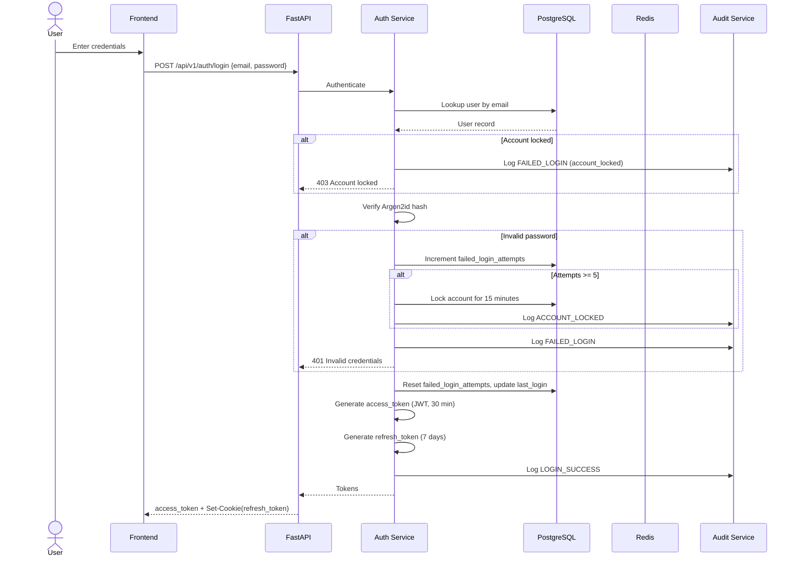
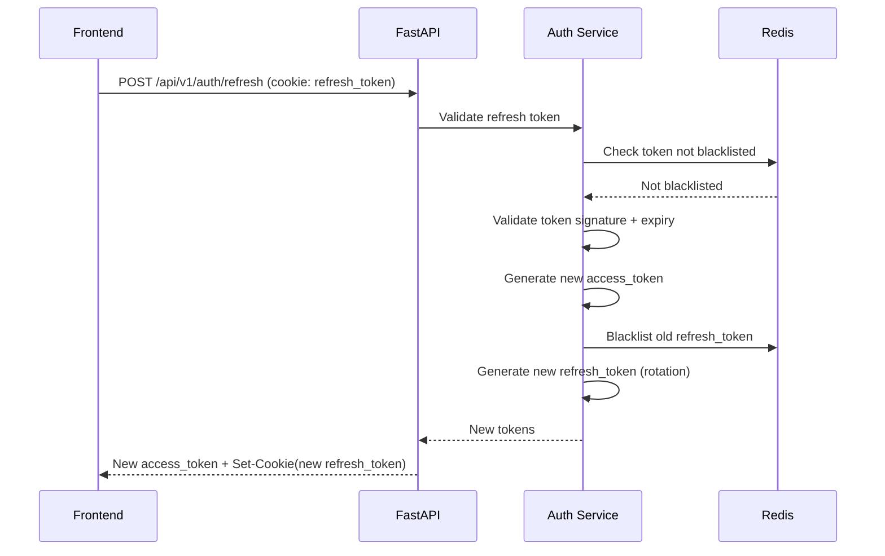
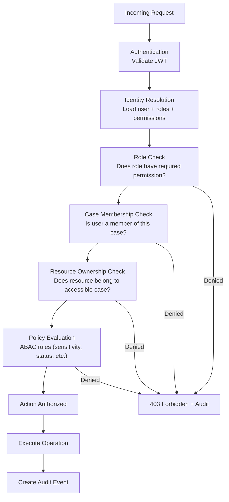
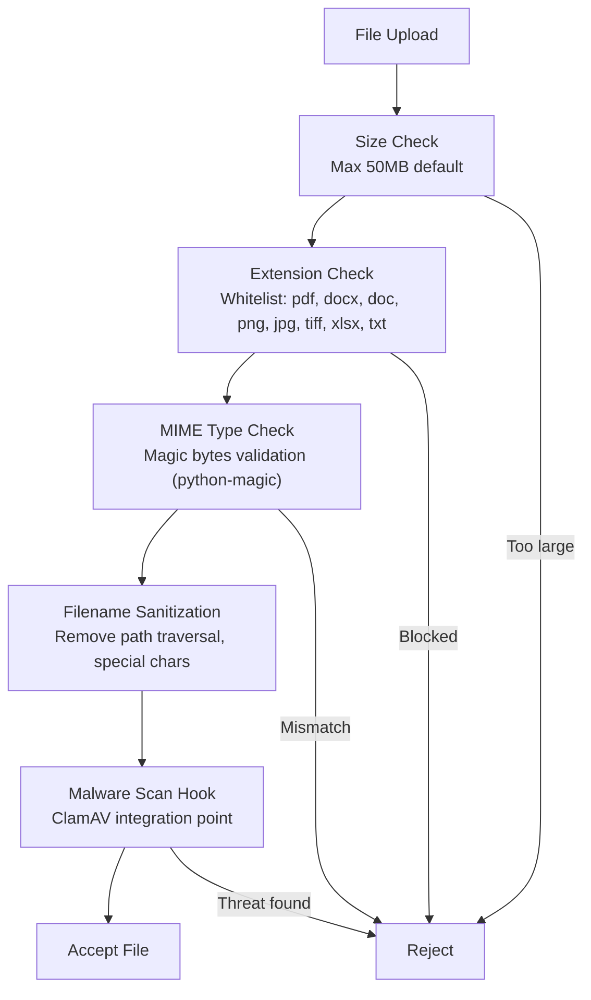
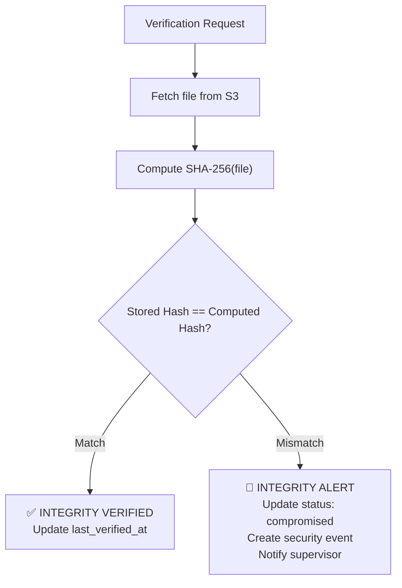

# Security Model — Secure Digital Evidence & Legal Case Lifecycle Management Platform

---

## 1. Security Philosophy

| Principle | Application |
|-----------|-------------|
| **Zero Trust** | Every request is authenticated and authorized; no implicit trust based on network position |
| **Defense in Depth** | Multiple security layers: network, transport, application, data |
| **Least Privilege** | Users and services get minimum required permissions |
| **Secure by Default** | New users have no access until explicitly granted; all endpoints require auth by default |
| **Fail Securely** | Errors default to deny; no information leakage through error messages |
| **Complete Mediation** | Every resource access goes through authorization check |

---

## 2. Authentication Architecture

### 2.1 Token Strategy

| Token | Type | Lifetime | Storage | Purpose |
|-------|------|----------|---------|---------|
| **Access Token** | JWT (HS256 or RS256) | 30 minutes | Frontend memory (never localStorage) | API authentication |
| **Refresh Token** | Opaque / JWT | 7 days | httpOnly, Secure, SameSite=Strict cookie | Token renewal |

### 2.2 JWT Claims

```json
{
  "sub": "user-uuid",
  "exp": 1234567890,
  "iat": 1234567890,
  "jti": "unique-token-id",
  "role": "investigator",
  "permissions": ["case:read", "document:upload"],
  "employee_id": "EMP001"
}
```

### 2.3 Password Hashing

- **Algorithm**: Argon2id
- **Parameters**: memory=65536 KB, iterations=3, parallelism=4
- **Salt**: Auto-generated, 16 bytes

### 2.4 Authentication Flow



### 2.5 Token Refresh Flow



### 2.6 Logout

- Blacklist current access token JTI in Redis (TTL = remaining token lifetime)
- Blacklist refresh token in Redis
- Clear httpOnly cookie

### 2.7 Account Lockout

| Parameter | Value |
|-----------|-------|
| Max failed attempts | 5 |
| Lockout duration | 15 minutes |
| Reset on success | Yes |
| Admin unlock | Yes |

---

## 3. Authorization Architecture

### 3.1 Model: RBAC + Case-Level ABAC



### 3.2 Role Hierarchy

```
System Administrator (full system access, no case data by default)
         │
    Supervisor (review + approve across assigned cases)
         │
    ┌────┴────┬──────────────┐
Investigator  Forensic Expert  Legal Officer
```

### 3.3 Permission Matrix

| Resource | Action | Investigator | Forensic Expert | Legal Officer | Supervisor | Sys Admin |
|----------|--------|:---:|:---:|:---:|:---:|:---:|
| **Cases** | Create | ✅ | ❌ | ❌ | ✅ | ❌ |
| **Cases** | Read (own) | ✅ | ✅ | ✅ | ✅ | ❌ |
| **Cases** | Update | ✅ | ❌ | ❌ | ✅ | ❌ |
| **Cases** | Close | ❌ | ❌ | ❌ | ✅ | ❌ |
| **Cases** | Add Members | ✅¹ | ❌ | ❌ | ✅ | ❌ |
| **Documents** | Upload | ✅ | ✅² | ✅² | ✅ | ❌ |
| **Documents** | Read (case) | ✅ | ✅ | ✅ | ✅ | ❌ |
| **Documents** | Download | ✅ | ✅ | ✅ | ✅ | ❌ |
| **Documents** | New Version | ✅ | ✅² | ✅² | ✅ | ❌ |
| **Evidence** | Register | ✅ | ❌ | ❌ | ✅ | ❌ |
| **Evidence** | Read (case) | ✅ | ✅ | ✅ | ✅ | ❌ |
| **Evidence** | Transfer | ✅³ | ✅³ | ❌ | ✅ | ❌ |
| **Evidence** | Receive | ✅ | ✅ | ✅ | ✅ | ❌ |
| **Evidence** | Verify | ✅ | ✅ | ✅ | ✅ | ❌ |
| **Evidence** | Download | ✅ | ✅ | ✅ | ✅ | ❌ |
| **Custody** | View Chain | ✅ | ✅ | ✅ | ✅ | ❌ |
| **Audit** | View (case) | ✅⁴ | ✅⁴ | ✅⁴ | ✅ | ✅⁵ |
| **Search** | Traditional | ✅ | ✅ | ✅ | ✅ | ❌ |
| **Search** | Semantic | ✅ | ✅ | ✅ | ✅ | ❌ |
| **AI** | Ask Assistant | ✅ | ✅ | ✅ | ✅ | ❌ |
| **Export** | Legal Package | ❌ | ❌ | ✅ | ✅ | ❌ |
| **Users** | CRUD | ❌ | ❌ | ❌ | ❌ | ✅ |
| **Roles** | Manage | ❌ | ❌ | ❌ | ❌ | ✅ |
| **Security** | View Events | ❌ | ❌ | ❌ | ✅⁶ | ✅ |
| **System** | Admin Panel | ❌ | ❌ | ❌ | ❌ | ✅ |

**Notes:**
1. Lead investigator only
2. For their assigned case / forensic reports / legal documents only
3. Current custodian only
4. Limited to own case events
5. System-wide audit (no document content access)
6. Summary view only

### 3.4 Case-Level Access Control

- Users can only access cases they are members of (via `case_members` table)
- Every document/evidence query is filtered by `case_id IN (user's authorized case IDs)`
- **Supervisor Access Scope (Locked Policy)**: In strict compliance with least-privilege principles, Supervisors do NOT have global case access. A Supervisor must be explicitly assigned to a case in `case_members` to inspect documents, evidence, or custody events for that case.
- System Admin manages users/system configuration but does NOT have read access to case content or documents.

---

## 4. Data Protection

### 4.1 Encryption

| Layer | Method | Details |
|-------|--------|---------|
| **In Transit** | TLS 1.2+ (1.3 preferred) | All client-server and inter-service communication |
| **At Rest (DB)** | PostgreSQL TDE (prod) | Transparent data encryption for database files |
| **At Rest (Storage)** | S3 SSE / MinIO encryption | Server-side encryption for stored objects |
| **Passwords** | Argon2id | One-way hash, never reversible |
| **Tokens** | JWT HS256/RS256 | Signed, time-limited, blacklistable |

### 4.2 Sensitive Data Handling & Download Security

- **PII in Logs**: Never log passwords, tokens, personal identifiers in plain text
- **Error Messages**: Generic user-facing errors; detailed errors only in secure server logs
- **Secure File Download**: No direct S3/MinIO URLs exposed to frontend. Downloads are proxied through FastAPI after verifying case membership. All downloads enforce `Content-Disposition: attachment; filename="<sanitized>"` and `X-Content-Type-Options: nosniff`.
- **Mandatory Download Audit**: Every document and evidence download is recorded in the append-only audit trail (`DOCUMENT_DOWNLOADED` / `EVIDENCE_DOWNLOADED`) with user ID, file hash, timestamp, and client IP.
- **Secrets**: Environment variables only; `.env` in `.gitignore`; never hardcoded

---

## 5. Input Validation & File Security

### 5.1 API Input Validation

- All request bodies validated via Pydantic v2 models
- Strict type checking, min/max lengths, regex patterns
- No raw SQL — SQLAlchemy ORM with parameterized queries only
- Path parameters validated as UUID format

### 5.2 File Upload Validation



### 5.3 Allowed File Types

| Type | Extensions | MIME Types |
|------|-----------|------------|
| PDF | `.pdf` | `application/pdf` |
| Word | `.docx`, `.doc` | `application/vnd.openxmlformats-officedocument.wordprocessingml.document`, `application/msword` |
| Images | `.png`, `.jpg`, `.jpeg`, `.tiff` | `image/png`, `image/jpeg`, `image/tiff` |
| Spreadsheets | `.xlsx`, `.xls` | `application/vnd.openxmlformats-officedocument.spreadsheetml.sheet` |
| Text | `.txt` | `text/plain` |

---

## 6. API Security

### 6.1 Rate Limiting

| Endpoint Category | Limit | Window |
|-------------------|-------|--------|
| Authentication (`/auth/*`) | 10 requests | 1 minute |
| File Uploads | 5 requests | 1 minute |
| Search | 30 requests | 1 minute |
| General API | 100 requests | 1 minute |
| AI/RAG | 20 requests | 1 minute |

### 6.2 Security Headers

```python
# Applied via middleware to all responses
headers = {
    "X-Content-Type-Options": "nosniff",
    "X-Frame-Options": "DENY",
    "X-XSS-Protection": "0",  # Modern browsers use CSP instead
    "Strict-Transport-Security": "max-age=31536000; includeSubDomains",
    "Content-Security-Policy": "default-src 'self'; script-src 'self'; style-src 'self' 'unsafe-inline'",
    "Referrer-Policy": "strict-origin-when-cross-origin",
    "Permissions-Policy": "camera=(), microphone=(), geolocation=()",
}
```

### 6.3 CORS Configuration

```python
# Development
origins = ["http://localhost:3000"]

# Production
origins = ["https://your-domain.gov.in"]
```

---

## 7. Threat Model

| # | Threat | OWASP Category | Mitigation | Priority |
|---|--------|----------------|------------|----------|
| 1 | **Broken Access Control** | A01:2021 | RBAC + case membership checks on every request | 🔴 Critical |
| 2 | **IDOR** | A01:2021 | UUID resource IDs + ownership validation + case scoping | 🔴 Critical |
| 3 | **Privilege Escalation** | A01:2021 | Role validation in backend, never trust frontend role claims | 🔴 Critical |
| 4 | **JWT Attacks** | A07:2021 | Algorithm pinning, short TTL, JTI blacklist, refresh rotation | 🔴 Critical |
| 5 | **Brute Force Login** | A07:2021 | Account lockout (5 attempts/15 min), rate limiting | 🟠 High |
| 6 | **Malicious File Upload** | A08:2021 | MIME validation, extension whitelist, ClamAV hook, size limits | 🟠 High |
| 7 | **Path Traversal** | A01:2021 | Filename sanitization, no user-controlled paths in storage | 🟠 High |
| 8 | **SQL Injection** | A03:2021 | SQLAlchemy ORM only, no raw SQL, parameterized queries | 🟠 High |
| 9 | **XSS** | A03:2021 | React auto-escaping, CSP headers, no dangerouslySetInnerHTML | 🟡 Medium |
| 10 | **CSRF** | A01:2021 | SameSite=Strict cookies, API uses Bearer tokens | 🟡 Medium |
| 11 | **SSRF** | A10:2021 | No user-controlled URLs in backend requests, allowlist external APIs | 🟡 Medium |
| 12 | **Sensitive Data Leakage** | A02:2021 | No PII in logs, generic error messages, secure headers | 🟠 High |
| 13 | **Insecure Error Handling** | A09:2021 | Custom exception handlers, no stack traces to clients | 🟡 Medium |
| 14 | **Evidence Tampering** | Domain-specific | SHA-256 integrity, hash-chained audit, original preservation | 🔴 Critical |
| 15 | **Unauthorized Document Download** | A01:2021 | Backend-proxied downloads, case membership required | 🔴 Critical |
| 16 | **Session Abuse** | A07:2021 | Token blacklist, refresh rotation, short access token TTL | 🟠 High |
| 17 | **Excessive Permissions** | A01:2021 | Least privilege defaults, explicit permission grants | 🟠 High |

---

## 8. Cryptographic Integrity

### 8.1 Document Hashing

- **Algorithm**: SHA-256 (via Python `hashlib`)
- **When**: Computed on upload, stored with document/evidence record
- **Verification**: Re-compute hash on download/access, compare with stored hash

### 8.2 Hash Verification Flow



### 8.3 Hash-Chained Audit Events

```
Event 1: hash = SHA256(event_data_1)
Event 2: hash = SHA256(event_data_2 + event_1_hash)
Event 3: hash = SHA256(event_data_3 + event_2_hash)
...
```

If any event is modified or deleted, the chain breaks and verification fails.

### 8.4 Integrity Statement

> SHA-256 proves file integrity relative to the recorded hash. It demonstrates the file has not been altered since the hash was recorded. Full legal authenticity also requires identity verification, provenance tracking, digital signatures, chain of custody, and organizational policy. The system provides these additional trust layers through its audit trail, custody chain, and role-based access controls.

---

## 9. AI Security Rules

### 9.1 Authorization Before Retrieval

```
CORRECT (Secure):
  User Question → Auth → AuthZ → Case Scope Filter → Permission Filter
  → Retrieve ONLY authorized doc chunks → LLM → Response

WRONG (Insecure):
  User Question → Retrieve ALL docs → LLM "filter" → Response
```

### 9.2 AI Constraints

| Rule | Rationale |
|------|-----------|
| AI NEVER decides if a user is authorized | Authorization is a security function, not an AI function |
| AI outputs are labeled as AI-generated | Users must know what is human-verified vs. AI-suggested |
| No unauthorized data in AI context | Only documents the user can access enter the RAG context |
| AI cannot modify data | AI provides suggestions; humans make changes |
| Prompt injection mitigation | Enforce Gemini native System Instructions (separated from user input); cap queries at 500 characters; filter control tokens; isolate context chunks inside structured JSON/XML delimiters |
| No sensitive data in external API logs | Minimize PII sent to Gemini; use data minimization principles |

---

## 10. Security Monitoring

### 10.1 Security Event Types

| Event Type | Severity | Trigger |
|------------|----------|---------|
| `FAILED_LOGIN` | INFO | Invalid credentials |
| `ACCOUNT_LOCKED` | WARNING | 5+ consecutive failed login attempts on a single account |
| `UNAUTHORIZED_ACCESS` | WARNING | Valid auth but insufficient permissions / cross-case access attempt |
| `INTEGRITY_ALERT` | CRITICAL | SHA-256 hash mismatch detected between stored record and disk file |
| `BRUTE_FORCE_DETECTED` | CRITICAL | >20 failed logins from the same IP within 5 minutes across any accounts (IP blocked via Redis for 30m) |
| `SUSPICIOUS_UPLOAD` | WARNING | File fails MIME magic bytes, exceeds limits, or triggers malware check |
| `PRIVILEGE_ESCALATION_ATTEMPT` | CRITICAL | Non-admin attempting to invoke `/admin/*` endpoints |
| `TOKEN_ABUSE` | WARNING | Blacklisted/reused refresh token detected |
| `CUSTODY_CHAIN_BREAK` | CRITICAL | Hash chain verification failure on custody event sequence |

### 10.2 Alerting

- In-app notifications for supervisors and admins
- Security events dashboard for system administrators
- Extensible to email/SMS/webhook in future

---

## 11. Security Testing Strategy

| Test Category | Scope | Tools |
|---------------|-------|-------|
| **Auth bypass tests** | Every endpoint reachable without auth returns 401 | pytest |
| **RBAC tests** | Each role can only access permitted resources | pytest |
| **IDOR tests** | Users cannot access other users' cases/documents | pytest |
| **File upload tests** | Malicious files rejected, path traversal blocked | pytest |
| **JWT tests** | Expired/invalid/tampered tokens rejected | pytest |
| **Rate limit tests** | Rate limits enforced correctly | pytest + locust |
| **Integrity tests** | Hash mismatch detected and alerted | pytest |
| **Input validation** | Malformed inputs rejected gracefully | pytest |

---

## 12. Compliance Considerations

| Framework | Relevance |
|-----------|-----------|
| **IT Act 2000 (India)** | Digital evidence admissibility, electronic records |
| **Indian Evidence Act (Sec 65B)** | Certificate for electronic records, integrity requirements |
| **Bharatiya Sakshya Adhiniyam 2023** | Modern evidence act replacing Indian Evidence Act |
| **Data Protection** | Personal data handling, consent, purpose limitation |
| **Government Security Guidelines** | CERT-In guidelines, NIC security policies |
| **OWASP Top 10** | Web application security baseline |

